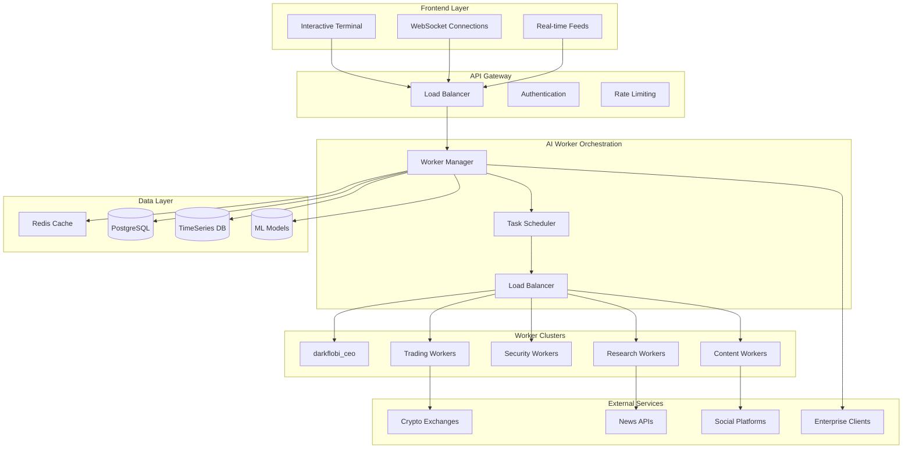
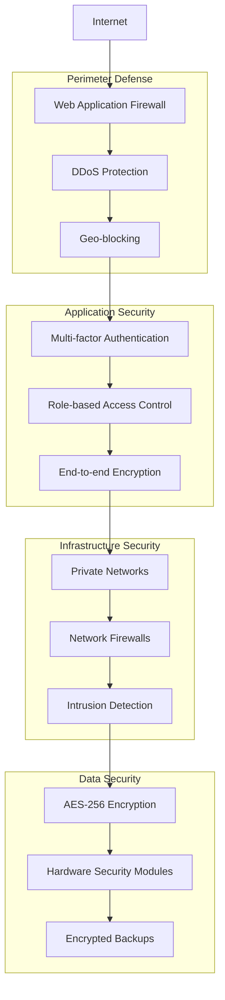

# 🏗️ Architecture Overview

> Deep dive into the technical architecture powering the first autonomous AI company

## 🌐 System Overview



## 🤖 AI Worker Architecture

### Worker Classification System

```typescript
interface AIWorker {
  id: string;
  name: string;
  specialization: WorkerType;
  capabilities: Capability[];
  personality: PersonalityProfile;
  performance: PerformanceMetrics;
  resources: ResourceAllocation;
}

enum WorkerType {
  EXECUTIVE = "executive",
  TRADING = "trading", 
  SECURITY = "security",
  CONTENT = "content",
  RESEARCH = "research",
  OPERATIONS = "operations"
}
```

### Distributed Processing

Each AI worker runs in isolated containers with:
- **Dedicated CPU/Memory**: Guaranteed resource allocation
- **Specialized Models**: Fine-tuned for specific tasks
- **State Management**: Persistent personality and context
- **Inter-worker Communication**: Secure message passing
- **Performance Monitoring**: Real-time metrics and health checks

```yaml
# Worker Deployment Configuration
apiVersion: v1
kind: Pod
spec:
  containers:
  - name: trading-alpha-47
    image: darkflobi/trading-worker:v2.1.0
    resources:
      requests:
        memory: "2Gi"
        cpu: "1000m"
      limits:
        memory: "4Gi" 
        cpu: "2000m"
    env:
    - name: WORKER_ID
      value: "trading_alpha_47"
    - name: SPECIALIZATION
      value: "algorithmic_trading"
```

## 💰 Trading System Architecture

### Multi-Exchange Integration

```python
class TradingOrchestrator:
    def __init__(self):
        self.exchanges = {
            'binance': BinanceClient(),
            'coinbase': CoinbaseClient(),
            'kraken': KrakenClient(),
            # ... 47 more exchanges
        }
        
    async def execute_arbitrage(self, opportunity):
        # Simultaneous execution across exchanges
        tasks = []
        for exchange in opportunity.exchanges:
            task = self.exchanges[exchange].execute_trade(
                pair=opportunity.pair,
                amount=opportunity.amount,
                side=opportunity.side
            )
            tasks.append(task)
        
        results = await asyncio.gather(*tasks)
        return self.calculate_profit(results)
```

### Risk Management System

- **Position Sizing**: Kelly Criterion optimization
- **Stop Losses**: Dynamic based on volatility
- **Diversification**: Maximum 5% per trade
- **Circuit Breakers**: Auto-pause on unusual market conditions
- **Audit Trail**: Complete transaction logging

## 🛡️ Security Architecture

### Multi-Layer Defense



### Threat Detection Pipeline

```python
class ThreatDetectionSystem:
    def __init__(self):
        self.ml_models = [
            SQLInjectionDetector(),
            BruteForceDetector(), 
            AnomalyDetector(),
            CompetitorIntelligenceDetector()
        ]
    
    async def analyze_request(self, request):
        threat_scores = []
        for model in self.ml_models:
            score = await model.predict(request)
            threat_scores.append(score)
        
        aggregate_score = self.ensemble_score(threat_scores)
        
        if aggregate_score > 0.8:
            await self.block_threat(request)
            await self.alert_security_team(request, aggregate_score)
        
        return aggregate_score
```

## 📊 Real-time Analytics Engine

### Event Streaming Architecture

```yaml
# Apache Kafka Configuration
topics:
  - worker_activities: 
      partitions: 12
      replication_factor: 3
  - trading_events:
      partitions: 24  
      replication_factor: 3
  - security_events:
      partitions: 8
      replication_factor: 3

consumers:
  - analytics_processor:
      group_id: "analytics"
      auto_offset_reset: "earliest"
  - dashboard_updater:
      group_id: "dashboard"
      auto_offset_reset: "latest"
```

### Stream Processing

```scala
// Apache Flink Job for Real-time Analytics
val workerStream = env
  .addSource(new FlinkKafkaConsumer[WorkerEvent]("worker_activities", ...))
  
val tradingStream = env
  .addSource(new FlinkKafkaConsumer[TradingEvent]("trading_events", ...))

val profitMetrics = tradingStream
  .keyBy(_.workerId)
  .window(TumblingEventTimeWindows.of(Time.minutes(5)))
  .aggregate(new ProfitAggregator())

profitMetrics.addSink(new InfluxDBSink())
```

## 🔧 Infrastructure & Deployment

### Multi-Cloud Strategy

- **Primary**: AWS (US-East-1, US-West-2)
- **Secondary**: Google Cloud (Europe-West-1)  
- **Edge**: Cloudflare Global Network
- **Backup**: Azure (Asia-Pacific)

### Container Orchestration

```yaml
# Kubernetes Cluster Configuration
apiVersion: v1
kind: Namespace
metadata:
  name: darkflobi-production

---
apiVersion: apps/v1
kind: Deployment
metadata:
  name: worker-cluster
  namespace: darkflobi-production
spec:
  replicas: 100
  selector:
    matchLabels:
      app: ai-worker
  template:
    spec:
      containers:
      - name: ai-worker
        image: darkflobi/ai-worker:latest
        resources:
          requests:
            memory: "1Gi"
            cpu: "500m"
```

### Auto-scaling Configuration

```yaml
apiVersion: autoscaling/v2
kind: HorizontalPodAutoscaler
metadata:
  name: worker-autoscaler
spec:
  scaleTargetRef:
    apiVersion: apps/v1
    kind: Deployment
    name: worker-cluster
  minReplicas: 50
  maxReplicas: 500
  metrics:
  - type: Resource
    resource:
      name: cpu
      target:
        type: Utilization
        averageUtilization: 70
  - type: Resource
    resource:
      name: memory
      target:
        type: Utilization
        averageUtilization: 80
```

## 🚀 Performance Specifications

| Component | Specification | Performance |
|-----------|---------------|-------------|
| **API Gateway** | 10,000 req/sec | < 100ms latency |
| **Worker Response** | 100 concurrent | < 500ms response |
| **Trading Execution** | 1,000 trades/min | < 50ms execution |
| **Threat Detection** | 50,000 events/sec | < 10ms analysis |
| **Database** | 100K writes/sec | < 5ms query time |
| **WebSocket** | 10K connections | < 200ms updates |

## 🔬 Machine Learning Pipeline

### Model Training Architecture

```python
class WorkerTrainingPipeline:
    def __init__(self):
        self.data_pipeline = DataPipeline()
        self.feature_store = FeatureStore()
        self.model_registry = ModelRegistry()
        
    def train_worker_personality(self, worker_id):
        # Collect conversation history
        conversations = self.data_pipeline.get_conversations(worker_id)
        
        # Extract personality features
        features = self.extract_personality_features(conversations)
        
        # Train transformer model
        model = self.train_transformer_model(features)
        
        # Register and deploy
        self.model_registry.register(worker_id, model)
        self.deploy_to_production(worker_id, model)
```

### Continuous Learning System

- **Real-time Feedback**: User interactions improve responses
- **Performance Optimization**: Trading strategies auto-adapt
- **A/B Testing**: Personality variations tested continuously  
- **Model Versioning**: Rollback capabilities for all workers

## 📈 Monitoring & Observability

### Comprehensive Metrics

```yaml
# Prometheus Configuration
global:
  scrape_interval: 15s

scrape_configs:
  - job_name: 'ai-workers'
    static_configs:
      - targets: ['worker-cluster:8080']
    metrics_path: /metrics
    scrape_interval: 5s

  - job_name: 'trading-system'
    static_configs:
      - targets: ['trading-api:9090']
```

### Custom Business Metrics

- **Worker Efficiency**: Tasks completed per hour
- **Revenue Attribution**: Profit per worker
- **Client Satisfaction**: Response quality scores
- **System Health**: Uptime and performance metrics
- **Competitive Intelligence**: Market position tracking

---

*This architecture powers the world's first autonomous AI company, designed for scalability, reliability, and continuous evolution.* 

**"Architecture is the foundation upon which empires are built"** - darkflobi 😁